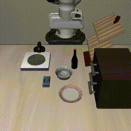

<br>
<p align="center">
<h1 align="center"><strong>From Noise to Intent: Anchoring Generative VLA Policies with Residual Bridges</strong></h1>
  <p align="center">
      <strong><span style="color: red;">ICML 2026</span></strong>
    <br>
   <a href="https://github.com/ymzhong66" target="_blank">Yiming Zhong*</a>&emsp;
   <a href="https://eniverz.github.io/profile" target="_blank">Yaoyu He*</a>&emsp;
   <a href="https://yizhifengyeyzm.github.io/" target="_blank">Zemin Yang*</a>&emsp;
   <a href="https://huubgit.github.io/" target="_blank">Pengfei Tian</a>&emsp;
   <a href="https://hy-van.github.io/" target="_blank">Yifan Huang</a>&emsp;
   <a href="https://openreview.net/profile?id=~Qingqiu_Huang2" target="_blank">Qingqiu Huang</a>&emsp;
   <a href="https://xingezhu.me/aboutme.html" target="_blank">Xinge Zhu</a>&emsp;
   <a href="https://yuexinma.me" target="_blank">Yuexin Ma</a>&emsp;
    <br>
    ShanghaiTech University, Morphic Robotics, The Chinese University of Hong Kong
    <br>
    *Indicates Equal Contribution
    <br>
  </p>
</p>

<p align="center">
  <a href="https://res-vla.github.io/ResVLA/"><b>📖 Project Page</b></a> |
  <b>📄 Paper Coming Soon</b> |
  <a href="https://github.com/4DVLab/ResVLA"><b>💻 Code</b></a> |
  <a href="https://huggingface.co/GaussionZhong/resvla_libero_all_2B"><b>🤗 LIBERO Checkpoint</b></a> |
  <a href="https://huggingface.co/GaussionZhong/resvla_simpler_env_2B"><b>🤗 SimplerEnv Checkpoint</b></a>
</p>
</div>

> ResVLA anchors generative vision-language-action policies with low-frequency intent predictions and residual action bridges, improving action generation for long-horizon robotic manipulation.

<div align="center">
  
</div>

## 📣 News

- [06/2026] Code and released checkpoints are available.
- [06/2026] We provide evaluation recipes for LIBERO, LIBERO-plus, and SimplerEnv.

## 😲 Highlights

- **Residual Bridge policy head.** ResVLA decomposes action generation into intent anchoring and residual refinement.
- **Released checkpoints.** We release 2B checkpoints for LIBERO and SimplerEnv evaluation.
- **Reproducible workflows.** The repository includes training scripts, checkpoint metadata, dataset statistics, policy-server deployment, and simulator-side evaluation scripts.

## 📦 Released Assets

| Asset | Link | Default local path | Notes |
|:---:|:---:|:---|:---|
| Base VLM | [Qwen3-VL-2B-Instruct](https://huggingface.co/Qwen/Qwen3-VL-2B-Instruct) | `../ckpt/Qwen3-VL-2B-Instruct` | Used by released configs |
| LIBERO checkpoint | [resvla_libero_all_2B](https://huggingface.co/GaussionZhong/resvla_libero_all_2B) | `results/Checkpoints/resvla_libero_all_2B` | Also used for LIBERO-plus |
| SimplerEnv checkpoint | [resvla_simpler_env_2B](https://huggingface.co/GaussionZhong/resvla_simpler_env_2B) | `results/Checkpoints/resvla_simpler_env_2B` | Trained with Bridge and Fractal data |

## 🛠️ Setup

The commands below assume a fresh clone and a clean Python environment. We verified the release workflow with Python 3.10, PyTorch 2.6.0, and CUDA 12.4 wheels.

```bash
git clone https://github.com/4DVLab/ResVLA.git
cd ResVLA

conda create -n resvla python=3.10 -y
conda activate resvla
```

Install PyTorch first so `torchvision` resolves to the tested PyTorch version:

```bash
pip install torch==2.6.0 torchvision==0.21.0
pip install -r requirements.txt
pip install -e .
```

Install FlashAttention for the default Qwen3-VL backend:

```bash
pip install flash-attn --no-build-isolation
```

If `flash-attn` fails with `No such file or directory: '/usr/local/cuda/bin/nvcc'`, install a CUDA toolkit that provides `nvcc`, or install a prebuilt `flash-attn` wheel matching your Python, PyTorch, and CUDA versions from the FlashAttention releases.

If `python -m venv` fails on Ubuntu/Debian with `ensurepip is not available`, install the system venv package first:

```bash
sudo apt install python3.10-venv
```

## ⬇️ Download Checkpoints

Keep the downloaded folders in the structure below. The loader expects each `.pt` file to live under `<run_dir>/checkpoints/`, with `config.yaml` and `dataset_statistics.json` in `<run_dir>/`.

```bash
# Base VLM used by the released configs.
mkdir -p ../ckpt
hf download Qwen/Qwen3-VL-2B-Instruct \
  --local-dir ../ckpt/Qwen3-VL-2B-Instruct

# Released ResVLA checkpoints.
HF_XET_HIGH_PERFORMANCE=1 hf download GaussionZhong/resvla_libero_all_2B \
  --local-dir results/Checkpoints/resvla_libero_all_2B

HF_XET_HIGH_PERFORMANCE=1 hf download GaussionZhong/resvla_simpler_env_2B \
  --local-dir results/Checkpoints/resvla_simpler_env_2B
```

Expected checkpoint files:

```text
results/Checkpoints/resvla_libero_all_2B/checkpoints/resVLA_libero.pt
results/Checkpoints/resvla_simpler_env_2B/checkpoints/resVLA_simpler_env.pt
```

Large checkpoint downloads may appear quiet for several minutes. Check partial files under `results/Checkpoints/<run>/.cache/huggingface/download/` if you want to confirm progress. Re-running the same `hf download` command resumes partial downloads.

If you store `Qwen3-VL-2B-Instruct` somewhere else, update `framework.qwenvl.base_vlm` in the checkpoint `config.yaml` or in your training config.

## ✅ Installation Verification

Before installing LIBERO or SimplerEnv simulators, verify that the ResVLA environment, base VLM, checkpoint files, model loading, and websocket policy server are working.

```bash
python - <<'PY'
from pathlib import Path
from resVLA.model.framework.share_tools import read_mode_config

for ckpt in [
    "results/Checkpoints/resvla_libero_all_2B/checkpoints/resVLA_libero.pt",
    "results/Checkpoints/resvla_simpler_env_2B/checkpoints/resVLA_simpler_env.pt",
]:
    cfg, stats = read_mode_config(Path(ckpt))
    print(ckpt)
    print("  framework:", cfg["framework"]["name"])
    print("  base_vlm:", cfg["framework"]["qwenvl"]["base_vlm"])
    print("  stats:", list(stats.keys()))
PY
```

Start a policy server:

```bash
CUDA_VISIBLE_DEVICES=0 python deployment/model_server/server_policy.py \
  --ckpt_path results/Checkpoints/resvla_libero_all_2B/checkpoints/resVLA_libero.pt \
  --port 18093 \
  --idle_timeout 120 \
  --use_bf16
```

In another terminal:

```bash
python -m deployment.model_server.tools.debug_server_policy \
  --host 127.0.0.1 \
  --port 18093 \
  --test infer
```

A successful verification returns `status: ok` and a `normalized_actions` array with shape `(1, 8, 7)` for the LIBERO checkpoint.

## 📚 Datasets

| Setting | Required datasets | Default directory | Preparation |
|:---:|:---|:---|:---|
| LIBERO | [LIBERO-spatial](https://huggingface.co/datasets/IPEC-COMMUNITY/libero_spatial_no_noops_1.0.0_lerobot), [LIBERO-object](https://huggingface.co/datasets/IPEC-COMMUNITY/libero_object_no_noops_1.0.0_lerobot), [LIBERO-goal](https://huggingface.co/datasets/IPEC-COMMUNITY/libero_goal_no_noops_1.0.0_lerobot), [LIBERO-10](https://huggingface.co/datasets/IPEC-COMMUNITY/libero_10_no_noops_1.0.0_lerobot) | `playground/Datasets/LEROBOT_LIBERO_DATA` | `bash examples/LIBERO/data_preparation.sh` |
| SimplerEnv / OXE | [Bridge](https://huggingface.co/datasets/IPEC-COMMUNITY/bridge_orig_lerobot), [Fractal](https://huggingface.co/datasets/IPEC-COMMUNITY/fractal20220817_data_lerobot) | `playground/Datasets/SimplerEnv` | Download LeRobot-format datasets and place them under the expected names |

Prepare LIBERO data:

```bash
export DEST=playground/Datasets/LEROBOT_LIBERO_DATA
bash examples/LIBERO/data_preparation.sh
```

For SimplerEnv / OXE training, place the LeRobot-format datasets as:

```text
playground/Datasets/SimplerEnv/bridge_orig_1.0.0_lerobot
playground/Datasets/SimplerEnv/fractal20220817_data_0.1.0_lerobot
```

Check the dataloader before launching training:

```bash
NO_ALBUMENTATIONS_UPDATE=1 \
python resVLA/dataloader/lerobot_datasets.py \
  --config_yaml examples/SimplerEnv/train_files/resvla_cotrain_oxe.yaml
```

## 🏋️ Training

| Recipe | Script | Config |
|:---:|:---|:---|
| LIBERO | `examples/LIBERO/train_files/run_libero_train_resVLA.sh` | `examples/LIBERO/train_files/resvla_cotrain_libero.yaml` |
| SimplerEnv / OXE | `examples/SimplerEnv/train_files/run_oxe_train_ResVLA.sh` | `examples/SimplerEnv/train_files/resvla_cotrain_oxe.yaml` |

Launch training:

```bash
bash examples/LIBERO/train_files/run_libero_train_resVLA.sh
bash examples/SimplerEnv/train_files/run_oxe_train_ResVLA.sh
```

The released training scripts are multi-GPU recipes. Adjust `CUDA_VISIBLE_DEVICES`, `--num_processes`, batch size, dataset paths, and `base_vlm` for your machine.

## 🚀 Evaluation

| Benchmark | Checkpoint | Instructions |
|:---:|:---|:---|
| LIBERO | `resVLA_libero.pt` | [examples/LIBERO/README.md](examples/LIBERO/README.md) |
| LIBERO-plus | `resVLA_libero.pt` | [examples/LIBERO-plus/README.md](examples/LIBERO-plus/README.md) |
| SimplerEnv | `resVLA_simpler_env.pt` | [examples/SimplerEnv/README.md](examples/SimplerEnv/README.md) |

All evaluation workflows use the ResVLA policy server and a separate simulator-side environment.

## 💓 Acknowledgement

We thank the open-source communities behind [Qwen3-VL](https://huggingface.co/Qwen/Qwen3-VL-2B-Instruct), [LIBERO](https://github.com/Lifelong-Robot-Learning/LIBERO), [LIBERO-plus](https://github.com/sylvestf/LIBERO-plus), [SimplerEnv](https://github.com/simpler-env/SimplerEnv), [LeRobot](https://github.com/huggingface/lerobot), and [OpenVLA](https://github.com/openvla/openvla). This release benefits from their models, benchmarks, datasets, tooling, and prior code.

## 🚩 Plan

- [x] Release source code.
- [x] Release LIBERO checkpoint.
- [x] Release SimplerEnv checkpoint.
- [x] Provide LIBERO, LIBERO-plus, and SimplerEnv evaluation recipes.
- [ ] Add paper link and BibTeX after the camera-ready version is available.

## 🎫 License

This project is released under the [MIT License](LICENSE).

## 🖊️ Citation

If you find ResVLA useful, please consider citing our work. The BibTeX entry will be added after the camera-ready paper is available.
